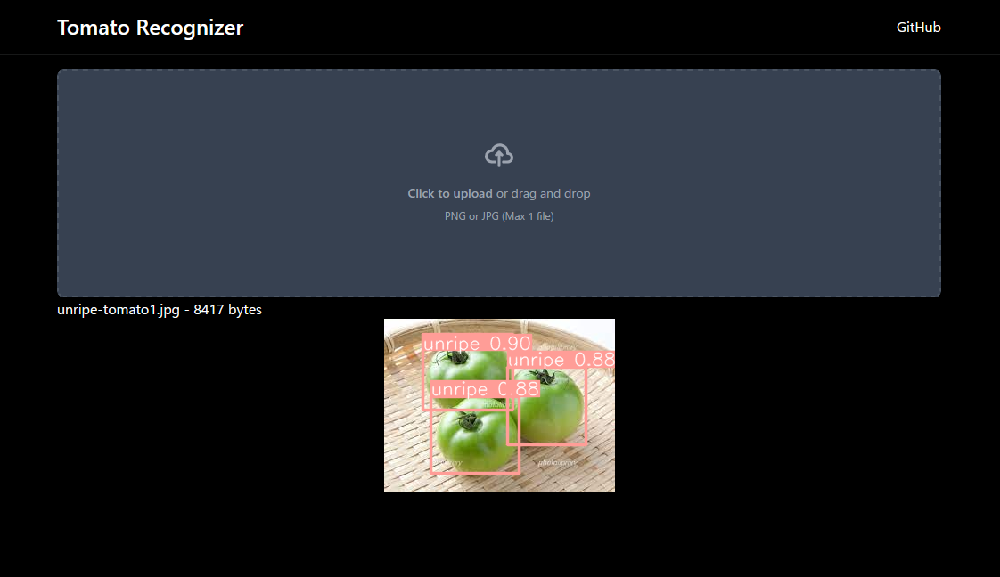
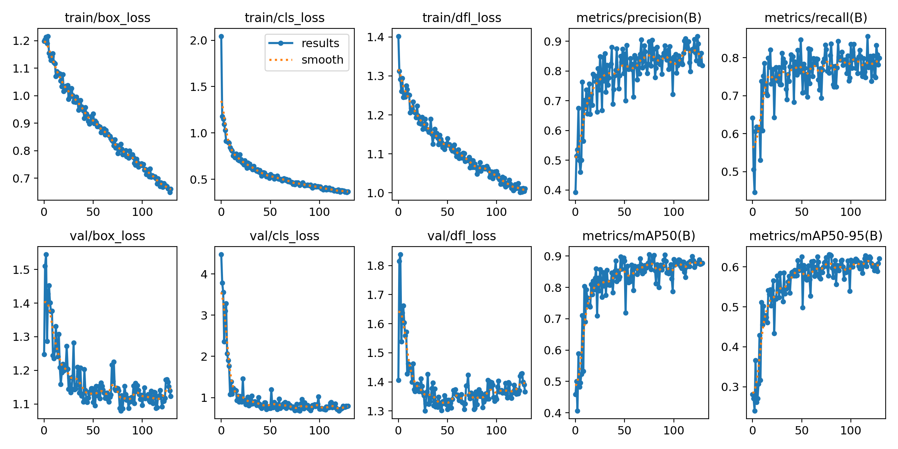

# Tomato recognizer




## About

Web application for identifying ripe and unripe tomatoes.  
I use YOLO for tomato detection.



## Usage

```bash
# Install dependencies
npm i && pip install -r ./requirements.txt
# Build
npm run build
# Start server
gunicorn app:app
```

Open http://localhost:50505/ with your browser to see the result.

## NOTICE

This application is based on an application created with Kyohei FUJITA, Masato YASUDA and Yuri ITO.
